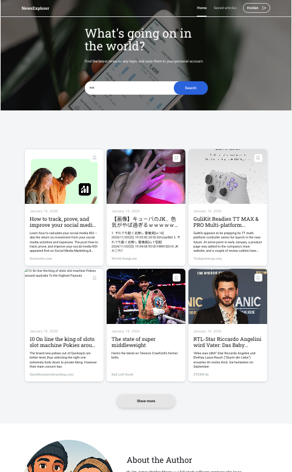
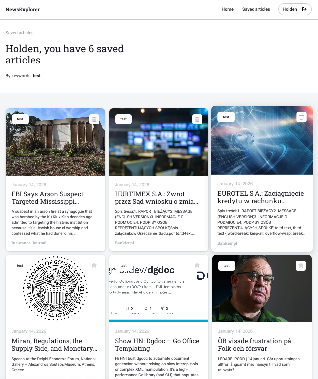
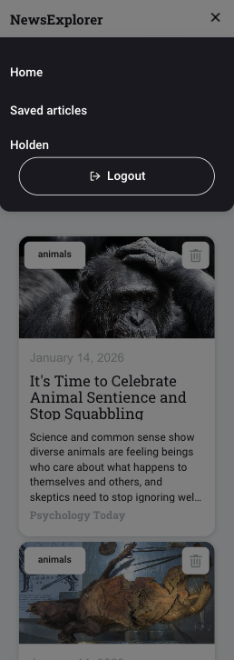
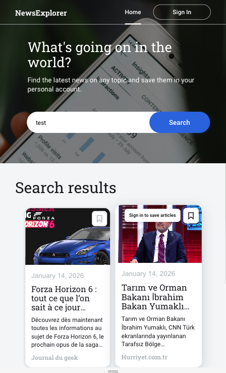
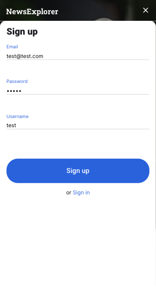
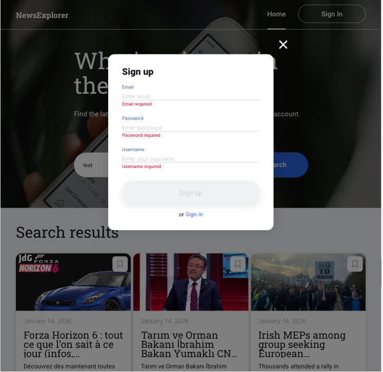

# News Explorer

A React-based web application that allows users to search for recent news articles via **NewsAPI**, explore results in a clean, card-based interface, and save articles for later reading. This project was built as part of **TripleTen — Sprint 16 (Final Project)** and demonstrates production-style frontend architecture, API integration, routing, and responsive UI design.

---

## Project Objective

The objective of **News Explorer** is to design and build a scalable, real-world React application that mirrors the behavior of a modern news aggregation product. The project focuses on integrating third-party APIs, managing asynchronous data flows, implementing authentication-aware UI behavior, and delivering a polished, responsive user experience across devices.

Key goals include:

- Demonstrating professional React architecture using functional components and hooks
- Implementing robust API interaction with loading and error states
- Designing a responsive, accessible UI suitable for production deployment
- Preparing the application for future full-stack expansion

---

## Features

- **Keyword Search** — Search for news articles from the last 7 days
- **Article Grid** — Responsive card layout with images, metadata, and external links
- **Pagination** — Incremental loading with _Show more / Show less_
- **Save Articles (Stage 1 simulation)** — Save behavior mocked using `localStorage`
- **Auth Tooltips** — UI prompts for unauthenticated users attempting protected actions
- **Preloader** — Animated loading indicator during API requests
- **Error Handling** — Friendly messages for empty results, invalid searches, and API/network errors
- **Responsive Design** — Optimized for desktop, tablet, and mobile (320px+)
- **Deployment Ready** — Configured for GitHub Pages

---

## Tech Stack

### Frontend

- React (functional components)
- Vite
- JSX
- CSS (BEM methodology)

### State & Routing

- React Hooks (`useState`, `useContext`)
- React Router

### API

- NewsAPI.org
- Production proxy: `nomoreparties.co`

### Styling & Assets

- Normalize.css
- Fonts: Roboto, Roboto Slab, Inter

### Deployment

- GitHub Pages

---

## Screenshots

### Search Results



### Loading State


### Saved Articles



### Mobile & Tablet




### Register Modal




---

## Installation & Setup

### 1. Clone the repository

```bash
git clone https://github.com/Jhm323/News-Explorer.git
cd News-Explorer
```

### 2. Install dependencies

```bash
npm install
```

### 3. Environment variables

Create a `.env` file in the project root:

```env
VITE_NEWS_API_KEY=your_api_key_here
```

> Get a free API key from NewsAPI.org.

### 4. Run locally

```bash
npm run dev
```

Open: [http://localhost:5173](http://localhost:5173)

### 5. Production build

```bash
npm run build
npm run preview
```

---

## Usage

### Search for News

1. Enter a keyword (e.g., `technology`, `climate`, `sports`)
2. Click **Search**
3. Results appear as cards displaying:

   - Title
   - Description
   - Publication date
   - Source and image

### View & Save Articles

- Click **Show more** to load additional articles (3 at a time)
- Hover over the save icon:

  - If logged out → tooltip: _“Sign in to save articles”_

- Saved articles are stored in `localStorage` (Stage 1 only)

### Navigation

- **Home** → `/`
- **Saved News** → `/saved-news` (simulated)
- External article links open in new tabs

---

## Architecture Overview

The application uses a component-driven React architecture with a clear separation of concerns. UI components, API logic, and helper utilities are organized into dedicated directories. State is managed locally using React hooks and context, while routing is handled with React Router to support multiple views. This structure improves maintainability, scalability, and readiness for backend integration.

---

## API Details

### Endpoint

- Development: `https://newsapi.org/v2/everything`
- Production: `https://nomoreparties.co/news/v2/everything`

### Parameters

- `q` — Search query
- `apiKey` — API key
- `from` / `to` — Date range (last 7 days)
- `pageSize` — 100 (max free tier)

### Response Fields Used

- `source.name`
- `title`
- `description`
- `publishedAt`
- `urlToImage`

### Error States

- No results found
- API or network error
- Invalid or empty search query

---

## Project Structure

```
src/
├── components/        # React components
├── utils/             # API and helper functions
├── assets/            # Images and static assets
├── vendor/            # Fonts and third-party files
├── blocks/            # BEM-based CSS
├── App.jsx            # Root component
└── main.jsx           # Vite entry point
```

---

## Browser & Device Support

Tested on Chrome, Firefox, and Safari. Fully responsive across desktop, tablet, and mobile devices (320px+).

---

## Conclusion

**News Explorer** successfully demonstrates the ability to design and implement a production-style React application with real-world features such as API integration, routing, loading and error handling, and authentication-aware UI patterns. The project reflects modern frontend best practices and provides a strong foundation for extending into a full-stack product.

---

## Future Improvements & Business Impact

- Implement backend authentication and persistent user accounts
- Replace `localStorage` with a database-backed saved articles system
- Add article categorization and personalized recommendations
- Introduce analytics to track user engagement and search behavior
- Improve SEO and social sharing metadata

From a business perspective, these enhancements could increase user retention, enable personalization, and support monetization through subscriptions or content partnerships.

---

## Deployment

Live Demo:
[https://jhm323.github.io/News-Explorer](https://jhm323.github.io/News-Explorer)

### Deploy to GitHub Pages

```bash
npm run build
```

- Push the build to GitHub
- Enable **GitHub Pages** in repository settings
- Select the `gh-pages` branch or root directory

---

## Contributing & Submission

This is a **TripleTen educational project**.

Guidelines:

- Work in the `stage-1-frontend-and-api` branch
- Submit a Pull Request to `main`
- Ensure all rubric criteria are met:

  - Responsive layout
  - Semantic HTML
  - BEM class naming

---

## License

This project is for educational purposes as part of the **TripleTen curriculum**. No license specified.

---

Built with React • Styled with BEM • Powered by NewsAPI
